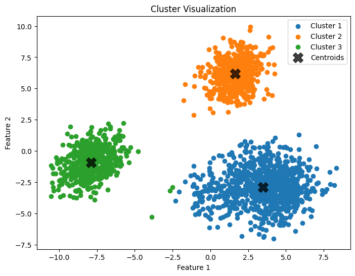
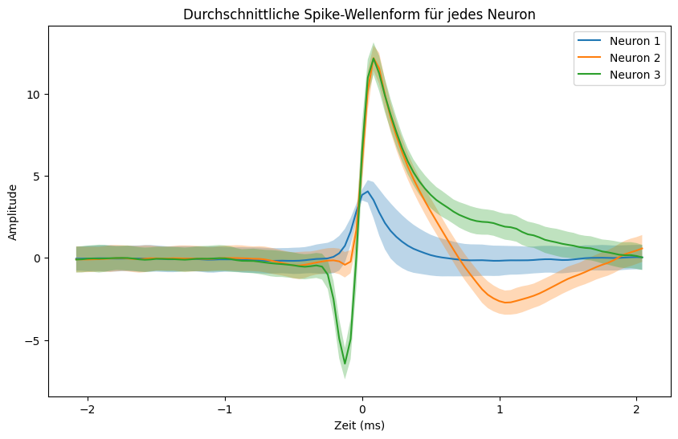

# Exercise 1
## Week 1: How to hear neurons talking?
In this exercise we were given multiple datasets of EEG brain recordings (5 synthetic samples, 1 real sample). The goal was to detect and differentiate neuron spikes in each of the recordings.

First step was to visit the data. The synthetic data contained an array that can be interpreted as the amplitudes of the wave recordings and ground truth spike data. The real data contained the same except for ground truth of course.

The pipeline works in the following steps:
- Bandpass filter to filter out noise so that only amplitudes that can be part of a spike remain.
- Normalize the data, so this method works on more than just one data set.
- Extract possible spike times by simple thesholding. Also filter out spikes that are too close to another, as those are unrealistic.
- Use the possible spike times to extract amplitude windows from the data, where in each window one spike may occur.
- Extract features from each window. Many features were tested, but only a few proved useful in the end.
- Normalize features for next steps
- Apply Principal Component Analysis (PCA) on the features.
    - I applied the elbow method to check how many are needed. 2 components work well. 
- Cluster the component data using K-Means.

==> Clusters now correspond to every detected neuron.

Average waveforms:

