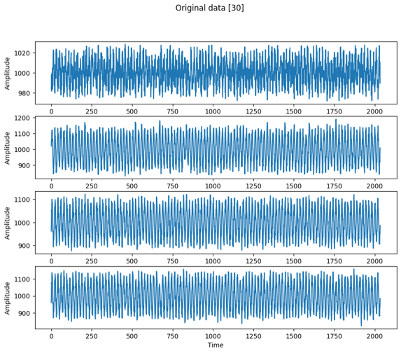
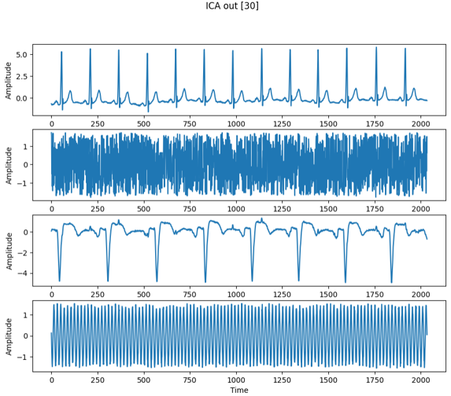
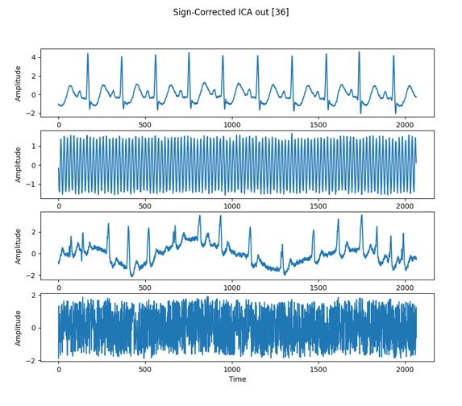
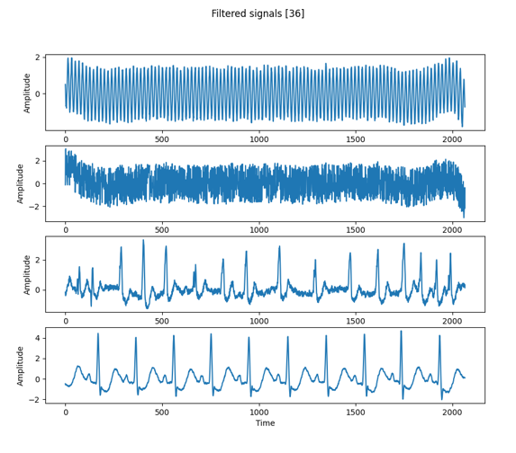
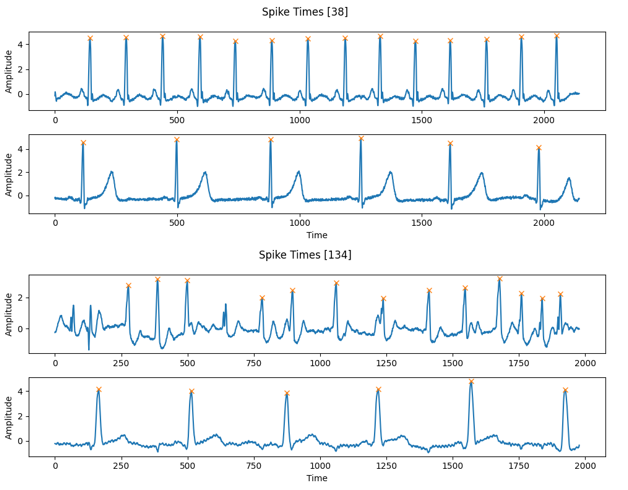
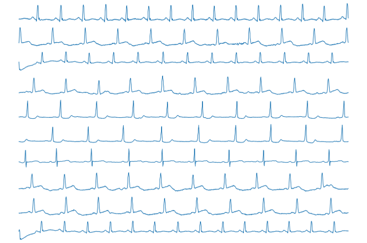
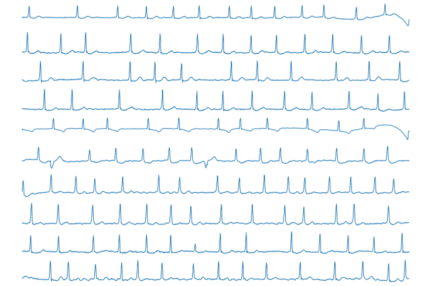
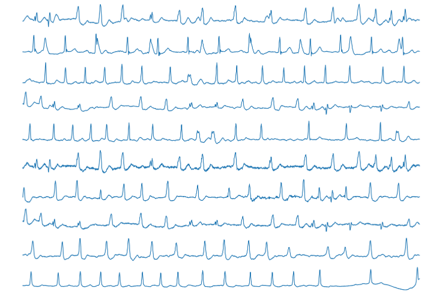
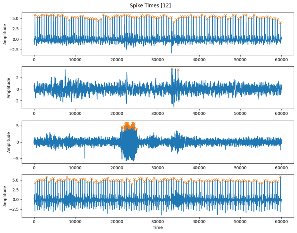
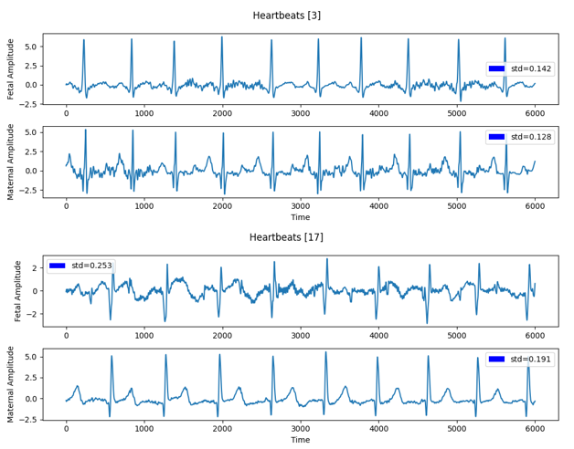

# Exercise 2
## Week 1: Preventative Medical Screening in Unborn
In this exercise we were given very many datasets of abdominal recordings of gestating patients (152 synthetic samples, 25 real samples). The goal was to detect and differentiate the maternal and fetal heartbeats. After that we had to find out whose data contained abnormal hearbeats, so that they should be sent to a doctor.

First step was to visit the data. Every sample contains 4 data streams of recorded amplitudes. The data at first looked very noisy, which makes sense, as each electrode records many signals at once.

The pipeline works in the following steps:
- Read all synthetic samples. And continue the following steps for each sample.
    - Normalize the sample data.
    - Apply Independant Component Analysis (ICA) on the data. This already worked great. On most samples we can visually differentiate the 2 hearbeat channels from noise channels, but some are flipped.
    - To get all channels oriented in the same way, I flip every channel, where 'abs(max) < abs(min)'. The channels are now still in random order and some still contain low frequency noise.
    - To filter out the noise, use a highpass filter. All samles look cleaner now.
    - To differentiate heartbeat channels from the noise, use simple thresholding. Noise channels seem to hover around the max amplitude, while heartbeat channels only periodically reach the max amplitude for a short time.
        - Count how often the amplitudes of each channel cross the threshold (1).
        - Sort by the amount of threshold crossings. The 2 channels with the lower count of crossings are the heartbeat channels.
        - This already works perfectly for all synthetic samples.
    - Next, to differentiate the maternal and fetal heartbeat channels, I try to detect the spikes. As the fetus is a smaller being than the adult mother, its heartbeat should always beat faster than the mothers. 
        - Simple thresholds are't good enough anymore, because some samples beat too irregularly, so the threshold may miss the off-beats.
        - Use 'scipy.find_peaks', which is a more advanced thresholding function. It features the parameters threshold (0.4), minimum distance (40), prominence (2.2) and a maximum width (30), which are intuitively tunable paramters. The threshold was set a bit lower than for the neurons to also include irregular heartbeat spikes. the other parameters were tuned to exclude the waves before and after the spikes.
        - This mostly works great. Now we cann differentiate between the fetal and maternal heartbeat.

- Next, to detect whether the patients of a sample may be ill, I tried a similar approach to exercise 1
    - Extract features. I tried many different features. It is critical, that a feature is invariant to shift of the data, as the spikes may occur at any arbitrary time in the data.
        - In the end I determined, that just two features were enough: spikes/time and standard deviation the distances between spikes.
    - Normalize the features.
    - Apply Principal Component Analysis (PCA). This step proved unnecessary, as we already had just 2 features, which we can cluster nicely.
    - I clustered using DBScan. Most samples should contain the data of healthy patients, so they should form one big cluster, while all samples of smaller/outlier clusters are considered possibly sick.
    - This returned nice clusters for the synthetic data.

==> The biggest cluster now contains the samples of healthy patients, while all other patients are considered possibly sick.

After ICA:  

After sign-flipping with noise:  

Filtered data:  

Detected peaks in two samples. The spikes in the upper sample were detected perfectly, while for the lower sample it was good enough:  

Next, I checked the multiple heartbeats of each cluster to be validate my results:

These hearts beat nice and regular. The are correctly labeled as healthy.  

The samples of te second biggest cluster contain many irregular or skipped heartbeats, so I am right about those being sick.  

The heartbeats of the outliers look very bad.  

## Week 2: Pathology Detection

Here I tried mostly the same method with some small changes.

- I swapped the highpass filter for a bandpass filter try and better filter out noise.
- After that some bad data points still remained in some samples. I filtered those out, whenever they had a Z-score above 6.3
- The rest of the maternal/fetal heartbeat detection still works the same, though with new parameters.

==> I obtained some maternal and fetal heartbeats, but I can't tell if they're correct.

==> Zooming into the data, it looks like we mostly obtained nice heartbeats.

Clustering did not return confidend results. This may be due to the much lower sample size compared to the synthetic data.

Spike detection worked okay for most samples, even if sometimes just barely, as some signals still contain a lot of noise or artifacts.  

Here, you can see the extracted heartbeats for 2 real samples.  
