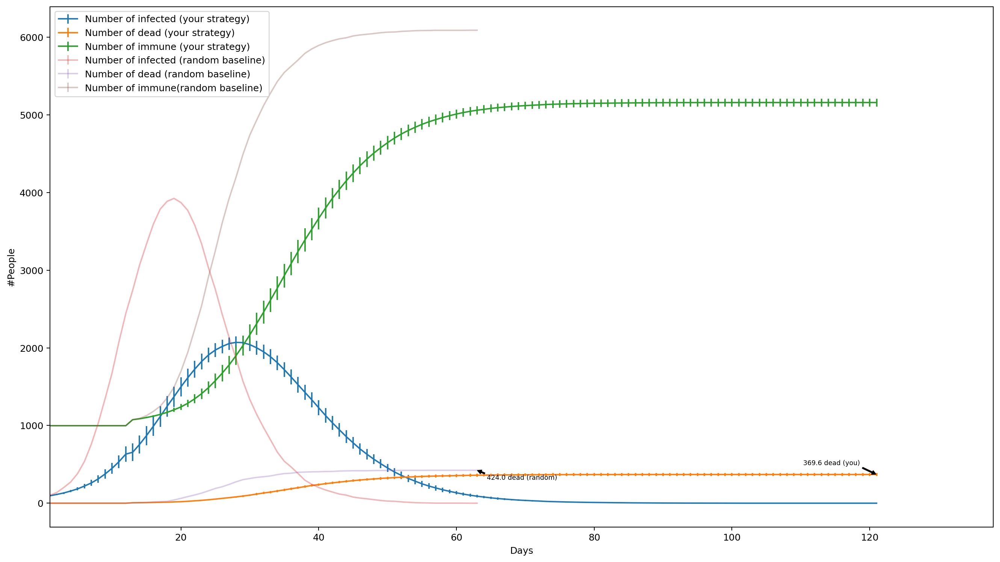
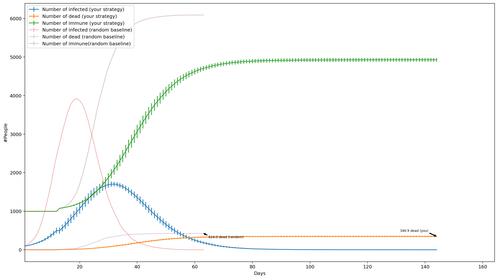

# Exercise 3: Vaccination Strategy for an Epidemic
## Problem setting
In this exercise the problem setting is, that there is a highly contagious virus going around the world. Our region has not been hit by it yet and there exists a vaccine against the disease. Problem is, that vaccines are only available for no more than 12% of the population. Futhermore the virus is symptom-less and social distancing cannot be applied, as everyone has a very active social life.  
The goal is now to select 12% of the population to give the vaccine to, such that the amount of deaths is minimized.  
As this problem is fictional, there was a simulation for it available. We were allowed to run the simulation with up to 4 sets of our selection of people to vaccinate. After the first simulation were told that the results of the simulation are averaged over 20 runs with 1% initial infectins, which are randomly selected. After a simulation we were only able to how many people survived. We were also given the results of a baseline simulation with a randomly selected subset ofthe population. It was also said, that as this is a hard problem with so little vaccines, a reduction in death-toll of >18% is a considerable success.
## What we know
We know, that after exactly 2 weeks of asymptomatic infection, the infected has a 8% chance of dying. Otherwise he becomes immune, with which no reinfection or transmission is possible. We don't know how infective the virus is.

We have data from a social media network, in which every citizen takes part. This network is used to find friends to visit real-life concerts with. The network provides us data about relations between the citizens/users (connections between user-ids) and possible concert genres and how often a concert of each genre takes place per year (dictionary, for example Rock:23, Classical: 12,...). We also know that 393/1000 friend pairs will attend a concert of a genre if they both like the genre, 18/1000 if only one like the genre and 2/1000 if none like the genre (visitation rates); other cases are insignificant. We can select citizens by their user id to have them vaccinated.

## Approach 1
First, I had to realise that the data takes the form of a undirected weighted graph. It makes sense, that we have to identify the users that can most effectively transmit the virus, so we can vaccinate them. It does not make sense to vaccinate users with little connections.

My first idea was to extract the users that with the highest probability will go the most often to a popular concert. We know, that a user will only attend a concet if at least one of their friends attends. Interpreted as a probability:

$P(x_1\space attends) = P(at\space least\space 1\space friend \space attends\space together\space with\space x_1)$  
$\Rightarrow P(at\space least\space 1\space friend \space attends\space together\space with\space x_1) = 1-P(no\space friend\space attends\space together\space with\space x_1)$  
$\Rightarrow P(no\space friend\space attends\space together\space with\space x_1) = P(friend_1\space doesn't\space attend, friend_2\space doesn't\space attend, ...)$  
$\Rightarrow P(friend_1\space doesn't\space attend, ...) = P(friend_1\space doesn't\space attend)\cdot P(friend_2\space doesn't\space attend)\cdot ...$

At this point I should note, that those equations are not entirely correct. Probalilities should have been summed instead of multiplied, with thich other groups got better results than me. Either way:

$\Rightarrow P(friend_i\space doesn't\space attend) = 1-P(friend_i\space attends\space with\space x_1)$  

I modelled $P(friend_i\space attends\space with\space x_1)$ using the preferences and visitation rates given in the data. I calculated a probability vector for every pair of friends, with which probability do they attend togehter to a concert of a genre. The counterprobabilities of those is then, that they won't attend a concert together.  
Then for all users I multiplied the probabilities for all their friends (probably should have been a summation). The counter probability of that is then $P(at\space least\space 1\space friend \space attends\space together\space with\space x_1)$. The result is now a vector of probabilities for every genre.  
To also incorporate concert popularities, I multiplied the probabilities with the counts of the concerts respectively for every genre, as concerts, which take place more often, are more important. I also counted for every genre how many people have a preference for that genre, if a concert happens very often, but no one likes it, it again should become less important. I divided the previous results by the counts of preferences for every genre.  
Finally I summed the elements of each vector and with this I had my final risk scores. I selected the 12% of users with the highest scores to be vaccinates.

### Result 1
Results of this method:

We can see, that this method is already a 12,8% improvement in death-toll over the random baseline. At this point I did not know yet about my mathematical error.

As I still had a free simulation run, I also tried with a vertex cover of the graph out of curiosity. This only improved by 4,7%, which was to be expected, as here every person is weighted as equally important to vaccinate, which is not a good approach as previously discussed.

## Approach 1 part 2
For the next runs of simulations it occurred to me, that whenever a person is vaccinated, the scores of all other persons should will change, because the vaccinated person cannot infect another person. So modified the approach so that I took out people iteratively. I calculate the scores, take the one with the highest score out and calculate the scores again without this person.  
Calculating the scores once took about 4-5 seconds. After I did this 1000 times I had a list of 12% of the population to vaccinate, which took about 144 minutes.

### Result 2

Results of the modified method:

We can see, that this method is a big improvement to before with a improvement in death-toll of 18,18% compared to random, with which this problem is considered solved.

## Another possible approach
There was another approach I had in my mind, which I did not have the time for to correctly implement. This approach does not concern probabilities.

Instead we view the graph of friends as clusters of friend groups, wherein the people are strongly connected together with many connections. In every friend group there are only some people, who have a connection to outside of the friend group, from where they could get infected and therefore also infect the whole group, as they are tightly connected. Other people of a friend group have only or mostly just connections inside the friend group and therefore will likely not start a infection chain in a cluster. In that sense the people sharing many connections to the outside are the key persons we should consider vaccinating, as if those are infected, we can be sure the whole cluster will get infected.

The approach to extract those key persons would then have been to use a Gaussian Mixture Model (GMM) with a k of about 200, so that there is about one cluster for every friend group. A good k could probably have been found by elbow method or similar. I would have used the GMM, because it has the nice feature of being able to differentiate between points that are very deep inside a cluster vs. points that are more on the outside of the cluster.  
The people that are on the outsides of the clusters and have many connections to other clusters should be identified as key individuals that can share infections across friend groups. They should be vaccinated, so when a cluster is infected, it is harder for the virus to spread to another cluster, as the connections would be vaccinated and therefore would not transmit the virus.

As far as I know another group used an approach similar to the one I've just outlined and they were able to achieve a reduction of about 24% or more, which shows, that this method would have been even better than the one I've went and implemented.