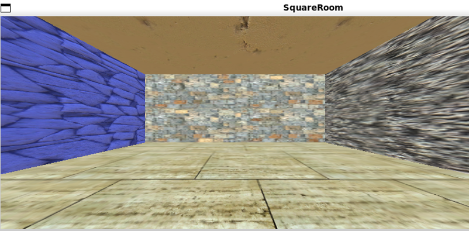

# Exercise 4: Keeping It Clean
## Problem setting
In this exercise the problem setting is, that we are working at a Roomba company and are tasked to create a system with which the Roomba can use Machine Learning to autonomously learn the layout of its environment and navigate through it.  
To be more specific: We should find a method that extracts a good representation of the environment using some given data. If the Robot is turned on in any place in the room, then the Roomba should be able to identify where in the room it is (for example with x,y coordinates). We should also discuss, why our representation is useful.

## Data
We were given two very simple Unity-Gym environments. One had the shape of a square, while other one was of an L-shape. The walls, sky and the floor have simple different textures.  
The Roomba features only a camera sensor and it can move in the cardinal directions while independantly rotating it's camera by 360° degrees. It also has a boolean that is set to true, whenever the Robot has just collided with a wall.  
We were also given for each room a set of 22000 images taken with the Roomba during a random walk around the rooms.

## Approach
After initial analysis of the problem and the available data we concluded, that all images of the rooms nicely lie on manifolds defined by x,y coordinates and a rotation. As rotation is a periodical feature, the manifold should have the shape similar to a torus.  
  
source: https://blender.stackexchange.com/questions/110125/making-square-torus-with-square-cross-section

So the approach was now to extract those parameters. Futhermore, to acutally predict x,y coordinates I planned to use Self Organizing Maps (SOM). The map would consist of multiple square stacked in a circle to approximate the circle.

## Extracting parameters
When we extract the 3 parameters from high dimensional images, it's kind of the same as when compressing the image to just those parameters. Because of this I chose to use an convolutional autoencoder to handle this task. After many tries of tuning the model architecture I settled for the encoder on 2 convolutional layers, followed by a dense layer, after which the output is compressed to a latent space. The decoder works mostly the same, just reversed.  
At first I tried using a latent space with only 3 dimensions (x,y,rotation), but then I had concerns with the continuity of the parameter. As the rotation is periodical, the model may have problems with putting that into just one parameter. But for example a circle is nicely representable in 2 dimensions. So I later tried a latent space with 4 dimensions (x,y +2 for the rotation as a continuous space).

Reconstructions:  
  
  

We can see, that the reconstructions already look nice. the model seems to have been able to learn the environment in a way, such that it can recreate the camera images based on just 3/4 parameters. Now we also have to confirm, that the representation does make sense.

## Evaluating the extracted representation
To evaluate the representation I created my own image data sets with the provided environments.

My first test was a data set, where the Roomba did not move, but only rotated once in a circle. I ran those images through the autoencoder and plotted the resulting latent space representations.  
  
  

We can see, that a circular structure has emerged. The problem with this structure is though, that is knotted, i.e. there is a point where the representation intersects itself during rotation. This is not ideal as a SOM would not be able to figure out a good mapping on the representation.  
My hypothesis for why this happens was that two walls have very similar shades of gray, so the model may have thought that those walls are the same. I tested this hypothesis by modifying the texture of one of the similar walls in the provided environment such that it becomes clearly different from the others. For that I used [[this](https://www.reddit.com/r/gamindustri/comments/18j3j3h/unity_textureimage_modding_tutorial_video_made/)] modding guide.

The resulting environment:  
  

The resulting representation:  
  
  

We can see, that the room is still twisted, but the representation does not intersect with itself anymore, with which I have proven my hypothesis. The textures are unlucky for the autoencoder. If the autoencoder was more complex it may have been able to differentiate the textures, but it is too simple for that as it is now.

Either way, next, I checked the room embeddings. For that I had the Roomba walk around the whole room in a snake-like pattern without rotating. This way I should get a representation that could be mapped to x,y coordinates using a SOM.

The resulting representation:  
  
  

We can identify a closed surface, even if not exactly rectangular. I also marked the corner point samples of the environment in red. We can see, that the corner points of the environment are also corner points of the representation.  
To understand the room embeddings better, I created another snake-walk data set, but this time rotated once by 90 degrees.

The resulting representations:  
  

Here we see, that those are the same surfaces, just rotated and moved in the space. So the embedding has the expected structure, though deformed.

With this we have seen, that the model did really output a meaningful representation of the environment. The lecturer later called this a success, as a reinforcement learning algorithm or similar could use this representation to navigate the room.  
My original plan to use SOM to acutally map the representation to get some kind of x,y coordinates did not work out though. Time ran out and more importantly the manifold cross sections we've seen previously are overlapping, which makes applying SOMs hard. The loops, where the manifold intersects itself during rotation make this even harder, but I'm confident that SOM would have been the next step to extract x,y coordinates, if the representation looked nicer.

L-Room representations:  
  
  

Similar story to before. Depending on the perspective and chosen latent space parameters for the visualization we can make out an L-shape in the representation, so the model again learned a meaningful representation. Extracting x,y coordinates is still hard though.

## Scrapped ideas
I've tried a lot of stuff to improve the results.
- Custom loss functions: To remove the twists in the rooms I've tried regularizing by the correlation between latent space parameters or adding a loss such that 2 of the 4 latent space parameters should be the axes of the sine and cosine functions. Those did not remove the twists, but instead just made the whole representation look more circular, which is useless.
- Periodic Autoencoder: Here I wanted the circular latent space representation to be integrated into the model architecture, so that the model would be forced to learn a correct circular representation, but the implementation failed. I did not have enough time to fix it.
- Another idea was also to misuse ResNet50 as an encoder for the autoencoder. The rationale here was, that this model should have already learned good spatial representations. But this just achieved similar results to before. I reason this is because either I've not trained enough or more likely because my decoder was too simple, as I could not train a big model on my available hardware.
